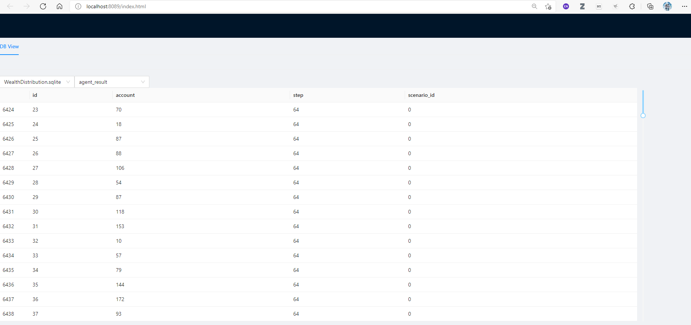

# README
[](https://travis-ci.com/SongminYu)

This project is supposed to be developed as a general framework that can be used to establish agent-based models for specific uses. Current main contributors are **Songmin YU** and **Zhanyi HOU**. 


#### 1 Meetings

- 20210707 - Brief exchange of development ideas
- 20210806 - Brief exchange about mesa and agentpy, and the plan of project
- 2021082x - Discuss classes design and their interaction (UML)


#### 2 Current Step

##### Songmin

- design classes and their interaction

##### Zhanyi

- travis
- codecov
- cookie-cutter


#### 3 Ideas


#### 4 Manager

### Supported Python Versions

Python from 3.7~3.9

PyPy interpreter is also supported. But Melodie is not designed 
for PyPy interpreter, so the performance may not be improved significantly.


run this command in project root:
```cmd
python -m Melodie serve
```
and visit this website:

http://localhost:8089/

The webpage will provide a simple database viewer with two selection widgets.
The one shows all database files in the path where you run this command and its
sub-folders, and the other shows all tables of current selected database.

This page loads the whole table data when you switch table, but only renders 
several rows instead of rendering them all. So in most cases there will be no worry
about performance.


#### Build Cython extension
```shell
pip install Cython
python.exe setup.py build_ext --inplace
```

#### Build docs
```shell
cd docs
sphinx-autobuild source build/html
# click the link appeared in the console to view the documentation website.
```

#### Create a file by project template
Run this command:
```shell
python -m Melodie create
```
This command will call a GUI template wizard (written by tkinter).
Just follow the wizard to create the program.

