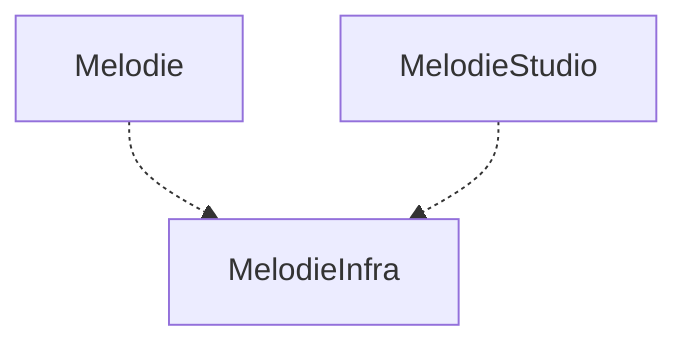

# Melodie: Agent-based Modeling in Python


[](https://github.com/ABM4ALL/Melodie/actions/workflows/wheels.yml)

**Melodie** is a general framework for developing agent-based models (ABMs) in Python.
Melodie and its example repositories are maintained on [ABM4ALL](https://github.com/ABM4ALL),
a developing community among agent-based modelers for sharing ideas and resources.


### To-dos:

* Songmin - finalize docs - introduction, tutorial
* Zhanyi - finalize docs - api, installation
* Zhanyi - write changelog (move to docs)
* Zhanyi - write contribution
* Songmin - write About
* publish Melodie repo and upload to pypi
* publish docs with GitHub Pages and use abm4all.com
* upload tutorial example - CovidContagion
* update model gallery and upload CovidGridContagion, CovidNetworkContagion


### Supported Python Versions

Python from 3.7~3.9

PyPy interpreter is also supported. But Melodie is not designed for PyPy interpreter, so the performance may not be
improved significantly.

### Run this project

```shell
git clone xxxx
pip install Cython pytest
python.exe setup.py build_ext --inplace
pytest
```

### Build docs

```shell
cd docs
sphinx-autobuild source build/html
# click the link appeared in the console to view the documentation website.
```

As for auto-generated API Documentation, run this command to update:
```shell
python setup.py build_ext -i
sphinx-build source build/html -E -a
```

### Melodie studio

Melodie has an integrated web-based GUI tool for creating new projects and database viewing. you could start it with
this command:

```sh
python -m Melodie studio
```

or if you have created a project, you could use the studio in a Python script:

```python3
import os

from Melodie.studio.main import studio_main
from Melodie import Config

config = Config(
    project_name='DemoProject',
    project_root=os.path.dirname(__file__),
    sqlite_folder='data/sqlite',
    excel_source_folder='data/excel_source',
    output_folder='data/output',
)

studio_main(config)
```

then visit `http://localhost:8089/` with browser


