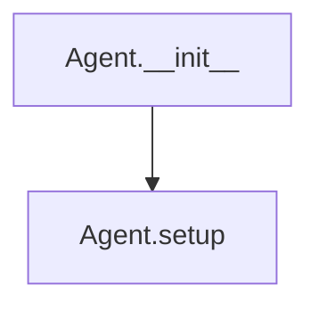
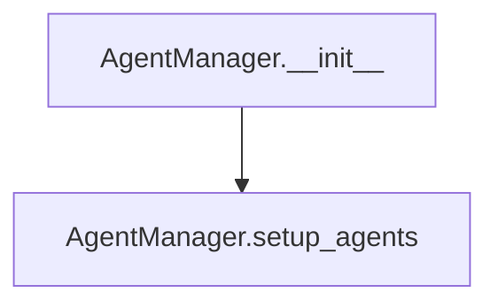
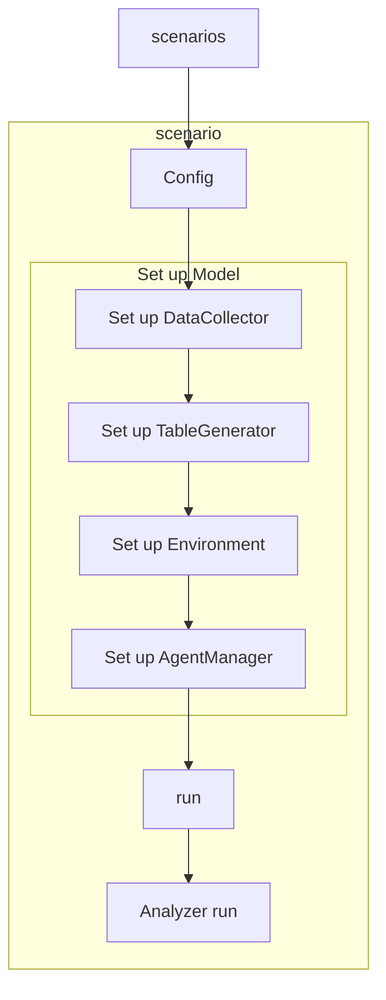

Melodie Architecture
-----
[TOC]
```mermaid
graph TD
sm[ScenarioManager]

model[Model]

al[AgentList]
env[Environment]
dc[DataCollector]
sm -->|Scenario| model %% |遍历每个Scenario,用每一个Scenario初始化模型，然后调用模型实例的run|
model-->al
model-->env
model-->dc %% 需要单独写，在里面写要保存的Agent和Environment的哪些参数。
al-->agent
agent[Agent]
%% agent-.->|globalref|env
env-.->|globalref|al

dc-.->env
dc-.->al
agent-.->env

db[DB]
tg[TableGenerator]
dc-.->db
tg-.->db
model-->tg
```

## Agent&AgentManager
Agent class in Melodie is the base agent class whose life cycle has several functions.

- `Agent.__init__` was defined by Melodie framework and called by AgentManager.
- `Agent.setup()` was defined by Melodie and overriden by user to add properties.

AgentManager stores all agent instances.
The developer need to pass Agent class (or subclass) and agent number into it.


- `__init__` was defined by Melodie, called by Model
- `setup_agents` was defined by Melodie, called in `AgentManager.__init__`.

## Scenario&ScenarioManager

## Model

## TableGenerator
## DataCollector
## Environment


## Database
Melodie stores model data in sqlite database.
```text
AGENT_PARAM_TABLE = 'agent_param'
AGENT_RESULT_TABLE = 'agent_result'
ENVIRONMENT_RESULT_TABLE = 'env_result'
```

## Config

# StartUp
```python
def run(
        agent_class: ClassVar['Agent'],
        environment_class: ClassVar['Environment'],
        config: 'Config' = None,
        data_collector_class: ClassVar['DataCollector'] = None,
        model_class: ClassVar['Model'] = None,
        scenario_manager_class: ClassVar['ScenarioManager'] = None,
        table_generator_class: ClassVar['TableGenerator'] = None,
        analyzer_class: ClassVar['Analyzer'] = None
):
    """
    Main Model for running model!
    If
    """
    global _model, _config
    if config is None:
        config = Config('Untitled')
        _config = config
    else:
        _config = config
        create_db_conn().reset()


    if model_class is None:
        model_class = Model

    if scenario_manager_class is None:
        scenario_manager = None
    else:
        scenario_manager: 'ScenarioManager' = scenario_manager_class()

    if scenario_manager is None:
        _model = model_class(config, environment_class, data_collector_class, table_generator_class)
        _model._setup()
        _model.run()
    else:
        for scenario in scenario_manager._scenarios:
            _model = model_class(config, agent_class,
                                 environment_class,
                                 data_collector_class,
                                 table_generator_class,
                                 scenario)
            _model._setup()
            _model.run()
            if analyzer_class is not None:
                analyzer_class().run()

```
