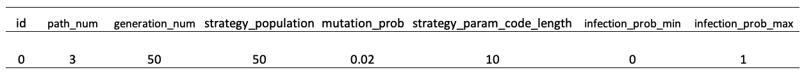
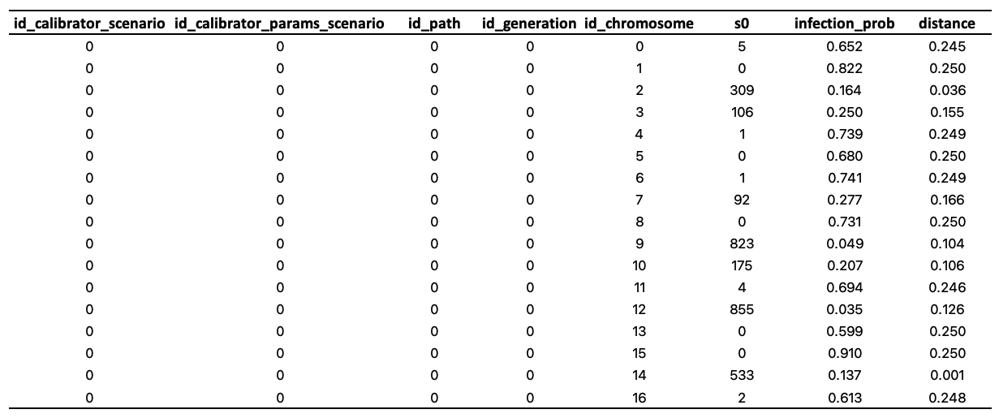
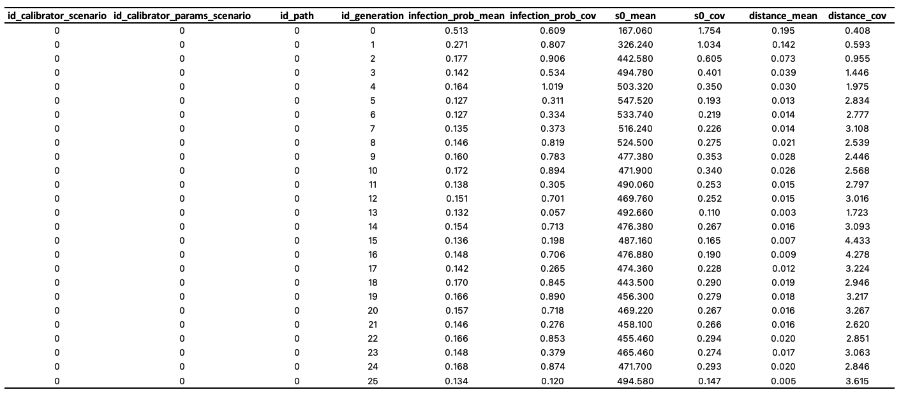
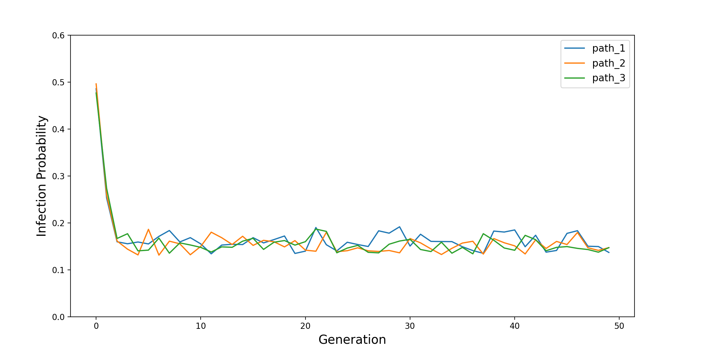
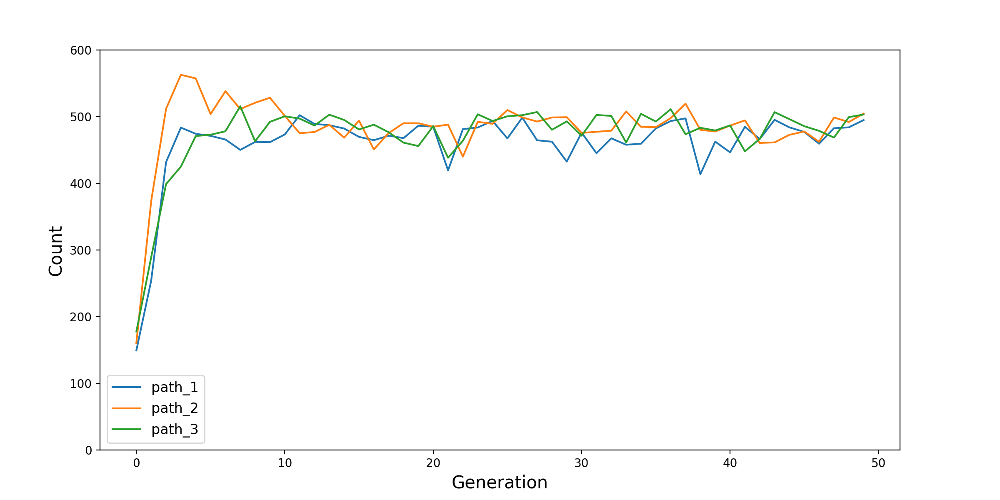

CovidContagionCalibrator
========================

To show how the ``Calibrator`` module can be used,
we provide this `CovidContagionCalibrator <https://github.com/ABM4ALL/CovidContagionCalibrator>`_ model,
which is almost same with the `CovidContagion <https://github.com/ABM4ALL/CovidContagion>`_ model.
The only difference is that, we can run it with another :ref:`Modelling Manager` - ``Calibrator``.
So, if you haven't, we will strongly suggest to read the :ref:`Tutorial` section first.

Project Structure
_________________

The project structure is as below.
Compared with the structure of the `CovidContagion <https://github.com/ABM4ALL/CovidContagion>`_ model,
two python files - ``calibrator.py`` and ``run_calibrator`` - files are added in the ``source`` and the ``root`` folders,
and two excel files - ``CalibratorScenarios.xlsx`` and ``CalibratorParamsScenarios.xlsx`` - are added in the ``data/input`` folder.

::

    CovidContagionCalibrator
    ├── data
    │   ├── input
    │   │   ├── SimulatorScenarios.xlsx
    │   │   ├── CalibratorScenarios.xlsx
    │   │   ├── CalibratorParamsScenarios.xlsx
    │   │   ├── ID_HealthState.xlsx
    │   │   ├── ID_AgeGroup.xlsx
    │   │   └── Parameter_AgeGroup_TransitionProb.xlsx
    │   └── output
    │       ├── CovidGridContagionCalibrator.sqlite
    │       ├── PopulationInfection_S0R0.png
    │       └── PopulationInfection_S1R0.png
    ├── source
    │   ├── agent.py
    │   ├── environment.py
    │   ├── grid.py
    │   ├── data_collector.py
    │   ├── data_info.py
    │   ├── data_loader.py
    │   ├── scenario.py
    │   ├── model.py
    │   ├── calibrator.py
    │   └── analyzer.py
    ├── config.py
    ├── run_simulator.py
    ├── run_calibrator.py
    ├── run_analyzer.py
    └── readme.md

Calibrator
__________

The idea of ``Calibrator`` in ``Melodie`` is to find the values of pre-defined parameters
- attributes of the ``scenario`` object -
so that the distance between model output and empirical data is minimized.
In this example, we want to find the value of ``scenario.infection_prob``,
so that  by the end of the simulation, the share of uninfected population is 50%.

For this, one file ``calibrator.py`` is added in the ``source`` folder.

.. code-block:: Python
   :caption: calibrator.py
   :linenos:
   :emphasize-lines: 10, 14

   from Melodie import Calibrator

   from source.environment import CovidEnvironment

   class CovidCalibrator(Calibrator):

       def setup(self):
           self.add_scenario_calibrating_property("infection_prob")
           self.add_environment_property("s0")

       def distance(self, model: "CovidModel") -> float:
           environment = model.environment
           return (environment.s0 / environment.scenario.agent_num - 0.5) ** 2

Two functions are defined in this ``CovidCalibrator`` class.

First, in the ``setup`` function, by using the ``add_scenario_calibrating_property`` function,
we define which attribute of the ``scenario`` will be calibrated.
``Melodie`` supports adding multiple parameters by calling the function again and passing in the name of the attribute.
However, in general, the more parameters you want to calibrate,
the longer time it could take and the lower quality of the results might be.
Additionally, as shown in Line 10, you can also ``add_environment_property`` so that they can be included in the result tables (see below).

Second, in the ``distance`` function,
you can define how the distance between the **model output** and the **empirical data** is measured.
The parameter of the ``distance`` function must be ``model``,
so that all the input data can be accessed through ``model.scenario``,
and all the macro- and micro-variables can be accessed through ``model.environment`` and ``model.agents``.
But, please note that, the values are all the values by the end of the simulation.
In this example, the calibration target is "50% of the agents are not infected by the end of simulation",

Algorithm
_________

In the current version, ``Melodie`` applies the `genetic algorithm (GA) <https://en.wikipedia.org/wiki/Genetic_algorithm>`_
to search the parameter space.
Relevant parameters are defined in the ``CalibratorParamsScenarios.xlsx`` file.

Please note that,

* First, in this model, we are only calibrating one parameter ``infection_prob`` and its space is :math:`[0, 1]`, as defined in the table by attributes ``infection_prob_min`` and ``infection_prob_max``.

* Second, the attribute ``strategy_param_code_length`` decides the length of the binary series used to code the parameter being calibrated. In the GA, it is the length of "chromosome". The longer it is, the higher accuracy of the coding is and the longer it might take for the calibration.

* Third, the ``generation_num``, ``strategy_population``, and ``mutation_prob`` are the three common parameters in GA. The larger the ``generation_num`` and ``strategy_population`` are, the longer the calibration process will take, but also the higher quality the results will be in general.

* Fourth, to evaluate the uncertainty of the GA-based calibration process, ``Melodie`` also provides the ``path_num`` parameter that decides how many times the calibration process is done.

* Finally, ``Melodie`` also supports batching calibration runs. Each run is a combination of one row in the ``CalibratorScenarios.xlsx`` file and another row in the ``CalibratorParamsScenarios.xlsx`` file. You only need to edit these two files and ``Melodie`` will automatically iterate through all the combinations for you.

Regarding the coding of parameter, for example,
if we want to code a parameter ranging in :math:`[0, a]` with a five-digit binary series.
First, map the five-digit binary number to a decimal number.
Second, divide the number by 31, which is the biggest decimal number that a five-digit binary number can represent,
then we get a number x in range :math:`[0, 1]`.
Third, scale x to the range :math:`[0, a]` linearly.
As a result, :math:`01001` is translated as :math:`x = 9a/31`.

Results
_______

After running the ``run_calibrator.py`` file, if you see following messages (or similar) printed,
it means the calibration process successfully went through.

.. code-block:: shell

   calibrator.py:391 INFO ====================Time Elapsed: 2.0582101345062256s====================
   parallel_manager.py:110 INFO terminated subworker <subprocess.Popen object at 0x7f87bc2e0f10>
   parallel_manager.py:110 INFO terminated subworker <subprocess.Popen object at 0x7f87bc361a60>
   parallel_manager.py:110 INFO terminated subworker <subprocess.Popen object at 0x7f87bc3585b0>
   parallel_manager.py:110 INFO terminated subworker <subprocess.Popen object at 0x7f87bc487820>
   parallel_manager.py:110 INFO terminated subworker <subprocess.Popen object at 0x7f87bc358190>
   parallel_manager.py:110 INFO terminated subworker <subprocess.Popen object at 0x7f87bc459430>
   parallel_manager.py:110 INFO terminated subworker <subprocess.Popen object at 0x7f87bc257880>
   parallel_manager.py:110 INFO terminated subworker <subprocess.Popen object at 0x7f87bc2572e0>
   server.py:123 INFO listener closed
   server.py:207 INFO goodbye ('127.0.0.1', 51509)
   server.py:207 INFO goodbye ('127.0.0.1', 51511)
   server.py:271 INFO server has terminated
   server.py:123 INFO listener closed
   parallel_manager.py:113 INFO Server closed!

Then, you will find two result table in the database.

First is the ``environment_calibrator_result`` table:

Second is the ``environment_calibrator_result_cov`` table:

As shown, ``environment_calibrator_result`` has one more index column, the ``id_chromosome`` column.
Then, ``environment_calibrator_result_cov`` calculates the ``mean`` and ``coefficient of variance`` (:math:`\mu / \sigma`)
of ``infection_prob``, ``s0``, and ``distance`` in each generation.

On top of the tutorial model,
one more function - ``plot_calibration_process`` - is added to plot the calibration process.
By calling it in the ``run_analyzer.py`` file,
two figures are produced based on the results in ``environment_calibrator_result_cov`` and saved in the ``data/output`` folder.
They are shown below.

For more details of the ``Calibrator`` module, please refer to the :ref:`API Reference` section.

