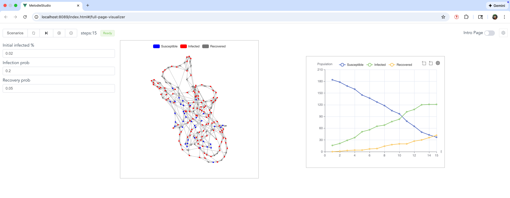

.. _covid_contagion_network_visual:

CovidContagionNetworkVisual
===========================

This example builds upon ``covid_contagion_network`` by adding a **Visualizer**.
It demonstrates how to use **MelodieStudio** to interactively run the simulation and view real-time animations of the network topology and data charts.

Visualizer: Project Structure
-----------------------------

The structure is similar to the network example but adds a visualizer component:

.. code-block:: text

    examples/covid_contagion_network_visual
    ├── core/
    │   ├── agent.py
    │   ├── environment.py
    │   ├── model.py
    │   ├── scenario.py
    │   ├── data_collector.py
    │   ├── visualizer.py       # Defines charts and network styling
    │   └── ...
    ├── data/
    │   └── ...
    ├── run_studio.py           # Launches MelodieStudio
    └── run_simulator.py        # Runs headless simulation

Visualizer: Key Changes
-----------------------

1. **Visualizer Class**:
   A new class ``CovidVisualizer`` inherits from ``Melodie.Visualizer``. It defines:

   - **Charts**: A line chart tracking the number of Susceptible, Infected, and Recovered agents.
   - **Network View**: A visual representation of the network where agents appear as colored nodes (Blue=Susceptible, Red=Infected, Gray=Recovered) connected by edges.

2. **MelodieStudio**:
   Instead of running a batch simulation immediately, the ``run_studio.py`` script starts a local web server (MelodieStudio). You can control the simulation (Start, Pause, Reset) from the browser.

Visualizer: Running the Model
-----------------------------

To run the model with the visualizer, execute the main script:

.. code-block:: bash

   python -m examples.covid_contagion_network_visual.run_studio

Then, open your browser and navigate to ``http://localhost:8089``. This is the web gateway for MelodieStudio. The backend simulation service will automatically run on ``127.0.0.1:8765``.

- In the web interface, go to the **Simulator** page.
- The interactive parameter controls will appear on the left. You can adjust them and click **Reset** to apply the new values.
- Click **Start** to begin the simulation.
- The network animation will be displayed in the center, and the line chart showing health state trends will be on the right.

Visualizer: Customization Guide
-------------------------------

Here's how you can customize the visualizer components:

**1. Adding Data Charts (e.g., Line Chart)**

- In ``core/visualizer.py``, use ``self.plot_charts.add_line_chart("unique_chart_name")`` to create a new chart.
- Chain it with ``.set_data_source({...})`` to bind data series. The values of the dictionary should be functions that return the numerical data for each time step (e.g., ``self.model.environment.num_susceptible``).
- You can add multiple charts (line, pie, bar) as long as each has a unique name.

**2. Configuring the Network View**

- Use ``self.add_network(...)`` to link the visualizer to your model's ``Network`` object.
- The ``var_style`` dictionary is key: it maps the integer values returned by ``var_getter`` to a specific color and a label for the legend.
- The legend for the network is automatically generated based on these labels.
- The network layout is automatically computed using NetworkX's spring layout algorithm.

**3. Adding an Interactive Parameter Panel**

- Use ``self.params_manager.add_param(...)`` to register interactive parameters. The example adds three ``FloatParam`` instances for:
    
    - ``initial_infected_percentage``
    - ``infection_prob``
    - ``recovery_prob``

- Each parameter requires a ``getter`` to read its current value from the ``Scenario`` and a ``setter`` to write the new value from the web UI back to the ``Scenario``.
- After changing a parameter in the UI, click the **Reset** button to restart the simulation with the new settings.

Visualizer: Code
----------------

This section shows the key code additions for the visualizer. Core logic files are the same as the ``covid_contagion_network`` example.

Visualizer Definition
~~~~~~~~~~~~~~~~~~~~~
This file is the core addition. It maps model data to visual elements. Defined in ``core/visualizer.py``.

.. literalinclude:: ../../../examples/covid_contagion_network_visual/core/visualizer.py
   :language: python
   :linenos:

Model Structure
~~~~~~~~~~~~~~~
*Same as the network example.* Defined in ``core/model.py``.

.. literalinclude:: ../../../examples/covid_contagion_network_visual/core/model.py
   :language: python
   :linenos:

Environment Logic
~~~~~~~~~~~~~~~~~
*Same as the network example.* Defined in ``core/environment.py``.

.. literalinclude:: ../../../examples/covid_contagion_network_visual/core/environment.py
   :language: python
   :linenos:

Agent Behavior
~~~~~~~~~~~~~~
*Same as the network example.* Defined in ``core/agent.py``.

.. literalinclude:: ../../../examples/covid_contagion_network_visual/core/agent.py
   :language: python
   :linenos:
