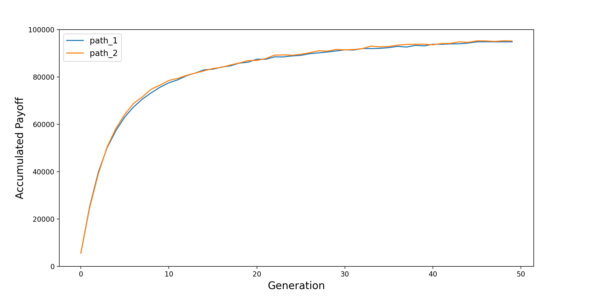
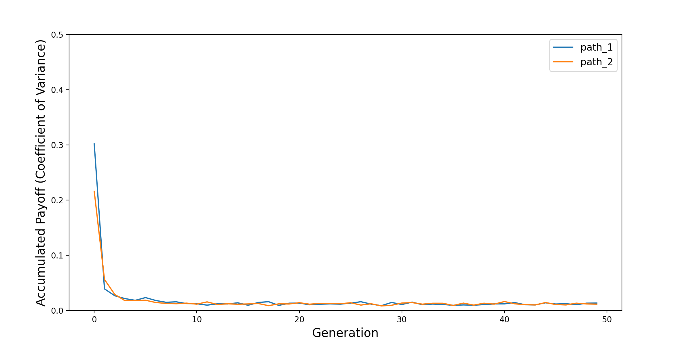

RockPaperScissorsTrainer
========================

To show how the ``Trainer`` module can be used,
we provide this `RockPaperScissorsTrainer <https://github.com/ABM4ALL/RockPaperScissorsTrainer>`_ model,
which implements the "evolutionary training" framework proposed in this
`paper <https://ieeexplore.ieee.org/document/9857838/>`_:

.. note::
   Yu, S. (2022). An Agent-Based Framework for Policy Simulation: Modeling Heterogeneous Behaviors With Modified Sigmoid Function and Evolutionary Training. *IEEE Transactions on Computational Social Systems*.

The ``RockPaperScissorsTrainer`` model is not as sophisticated as the one in the paper,
as the agents' behaviors are not modeled with the modified sigmoid function,
however, the evolutionary training is implemented based on the
`genetic algorithm (GA) <https://en.wikipedia.org/wiki/Genetic_algorithm>`_ in the same way.

Before diving in, we will strongly suggest you to read the :ref:`Tutorial` section and get familiar with the
`CovidContagion <https://github.com/ABM4ALL/CovidContagion>`_ model first,
as this ``RockPaperScissorsTrainer`` model follows similar structure.
The main difference is, you can run the model with either
(1) ``Simulator`` based on randomly initialized behavioral parameters of the agents, or
(2) ``Trainer`` so that the agents will individual update their behavioral parameters for higher payoff.

Then, you can load the trained behavioral parameters into the model to initialize the agents,
and then run the model again with the ``Simulator``.
As explained in the `paper <https://ieeexplore.ieee.org/document/9857838/>`_ above,
by combining the optimization (evolutionary training) and simulation methods in such a framework,
the validity and flexibility of agent-based modeling are balanced.

Model Setup
___________

In this model, the agents play the rock-paper-scissors game with each other.

We make following assumptions:

* First, winning, losing and tie results bring positive, negative, and 0 payoff to the agents.
* Second, the agents have heterogeneous "preference", i.e., wining or losing with different actions bring different payoff to the agents.

As a result, theoretically, the agents should have different "behavioral parameters".
For example, for a agent who gets higher payoff by winning with rock than paper,
it should have a higher probability to play rock than paper.

To model the "selection probability" of each option,
we assign three behavioral parameters to each agent: :math:`\alpha_r`, :math:`\alpha_p`, :math:`\alpha_s`.
Then, the probability for the agent to play the three options are:

* Rock :math:`\rightarrow` :math:`\alpha_r / (\alpha_r + \alpha_p + \alpha_s)`
* Paper :math:`\rightarrow` :math:`\alpha_p / (\alpha_r + \alpha_p + \alpha_s)`
* Scissors :math:`\rightarrow` :math:`\alpha_s / (\alpha_r + \alpha_p + \alpha_s)`

To train the three behavioral parameters for each agent before producing meaningful model results with ``Simulator``,
``Melodie`` provides the ``Trainer`` module.

Trainer
_______

Following the methodology introduced in the `paper <https://ieeexplore.ieee.org/document/9857838/>`_ above,
the ``Trainer`` module applies individual GA-based evolutionary training to "calibrate" the behavioral parameters of agents.
All the relevant mechanisms are written in the ``trainer.py`` file as follows.

.. code-block:: Python
   :caption: trainer.py
   :linenos:
   :emphasize-lines: 9-15

   from Melodie import Trainer
   from source.agent import RPSAgent

   class RPSTrainer(Trainer):

       def setup(self):
           self.add_agent_training_property(
               "agents",
               [
                   "strategy_param_1",
                   "strategy_param_2",
                   "strategy_param_3"
               ],
               lambda scenario: list(range(scenario.agent_num)),
           )

       def collect_data(self):
           self.add_agent_property("agents", "strategy_param_1")
           self.add_agent_property("agents", "strategy_param_2")
           self.add_agent_property("agents", "strategy_param_3")
           self.add_agent_property("agents", "share_rock")
           self.add_agent_property("agents", "share_paper")
           self.add_agent_property("agents", "share_scissors")
           self.add_environment_property("total_accumulated_payoff")

       def utility(self, agent: RPSAgent):
           return agent.accumulated_payoff

As shown, there are three functions defined in the ``RPSTrainer`` class.

* First, in the ``setup`` function, by using the ``add_agent_training_property`` function, you can define for which agent list (Line 9), which behavioral parameters (Line 10-14), and which agents in the list (Line 15) you want to train.
* Second, in the ``collect_data`` function, you can define which results you want to collect, so that you can analyze their evolution processes during the training afterward.
* Third, in the ``utility`` function, you can define the "target" that the agents want to maximize by updating their behavioral parameters in the evolutionary training process. Please note that, the "target" can be updated every period, but the agents maximize its value in the last period.

For further details about the ``Trainer`` module,
please read the `paper <https://ieeexplore.ieee.org/document/9857838/>`_ mentioned above.

Results
_______

After running the ``run_trainer`` file, four tables will be generated:

* agents_trainer_result
* agents_trainer_result_cov
* environment_trainer_result
* environment_trainer_result_cov

As indicated by their names,
the tables contain the evolution processes of the variables that are added in the ``RPSTrainer.collect_data`` function,
including micro-level variables of the agents and macro-level variables of the environment.
Similar to the :ref:`CovidContagionCalibrator` model, the "_cov" part in the table name indicates
if the results of the chromosomes are aggregated as "mean" and "coefficient of variance" values.

In this document, we provide the evolution process of one key result at the macro-level:
the total accumulated payoff of all the agents by the end of the simulation.
From the ``environment_trainer_result_cov`` table, we provide its mean and cov values as below.

As shown, in the training generations, the agents update their behavioral parameters so that their payoffs are improved.
Because the agents have "heterogeneous preference", they are not playing a zero-sum game.
On the other hand, the coefficient of variance (:math:`\mu / \sigma`) also declines in the training,
which indicates a convergence, i.e., the stability of this individual GA-based training algorithm.
We tested with two paths and they followed similar pattern.

We believe that there must be also interesting results at the agent-level in the training process.
Feel free to run the model and explore the database.

For more details of the ``Trainer`` module, please refer to the :ref:`API Reference` section.

