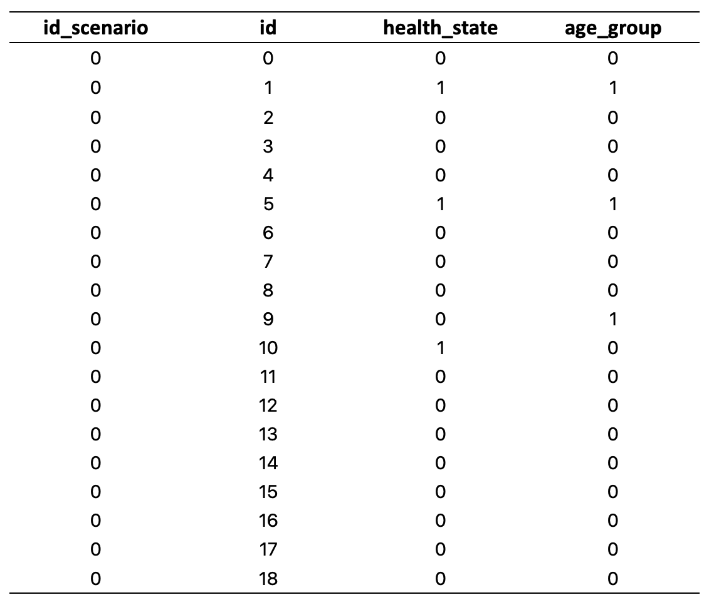
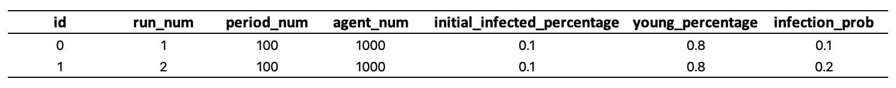
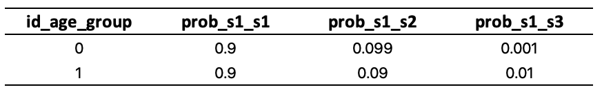
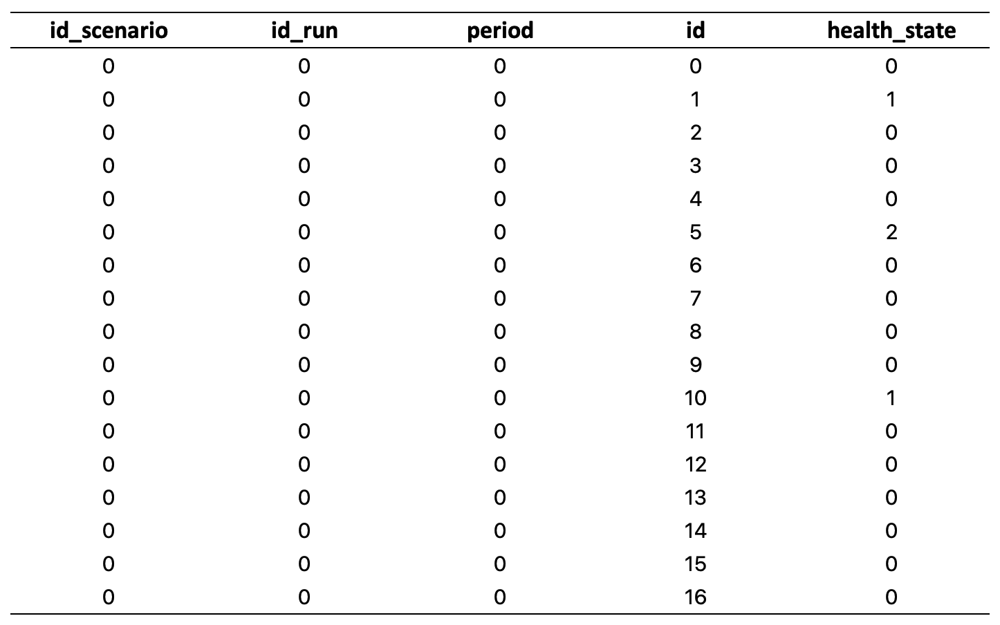

Tutorial
========

This tutorial provides an example modeling the contagion process of Covid-19 in a population of agents.
We make following assumptions in the model:

* Each agent has two attributes: ``health_state`` and ``age_group``.
* We consider four **health states** numbered from 0 to 3, meaning "not infected", "infected", "recovered", and "dead", respectively.
* We consider two **age groups** numbered from 0 to 1, meaning "young" and "old", respectively. A young person has a higher probability to recover from infection, and an old person has a lower probability to recover from infection.
* A "not infected" person can be infected by a "infected" person. The probability is an exogenous parameter ``infection_prob``. When 10% of the people are infected, we assume a "not infected" person has 0.1 probability to contact with a "infected" person, so the total infection probability is 0.1 :math:`\times` ``infection_prob``.

With these assumptions, this CovidContagion model is a minimum example of Melodie
but shows a clear project structure and the use of most important modules.

Project Structure
_________________

The full structure of the project is as below, including the produced database and figures.

::

    CovidContagion
    ├── data
    │   ├── input
    │   │   ├── SimulatorScenarios.xlsx
    │   │   ├── ID_HealthState.xlsx
    │   │   ├── ID_AgeGroup.xlsx
    │   │   └── Parameter_AgeGroup_TransitionProb.xlsx
    │   └── output
    │       ├── CovidContagion.sqlite
    │       ├── PopulationInfection_S0R0.png
    │       └── PopulationInfection_S1R0.png
    ├── source
    │   ├── agent.py
    │   ├── environment.py
    │   ├── data_collector.py
    │   ├── data_info.py
    │   ├── data_loader.py
    │   ├── scenario.py
    │   ├── model.py
    │   └── analyzer.py
    ├── config.py
    ├── run_simulator.py
    ├── run_analyzer.py
    └── readme.md

In the ``config.py``, you can define how the input and output files are organized.

.. code-block:: Python
   :caption: config.py
   :linenos:
   :emphasize-lines: 5

   import os
   from Melodie import Config

   config = Config(
       project_name="CovidContagion",
       project_root=os.path.dirname(__file__),
       input_folder="data/input",
       output_folder="data/output"
   )

If the ``config.project_name`` attribute is different,
then the name of ``CovidContagion.sqlite`` will also be changed accordingly.

Agent
_____

To create the ``CovidAgent`` class, ``Melodie`` provides the ``Agent`` class that can be inherited.
In Line 6, ``CovidAgent.setup`` overrides the ``Agent.setup`` function from ``Melodie``
and will be automatically called when setting up the agent objects.

.. code-block:: Python
   :caption: agent.py
   :linenos:
   :emphasize-lines: 6

   from Melodie import Agent

   class CovidAgent(Agent):

       def setup(self):
           self.health_state: int = 0
           self.age_group: int = 0

The attributes of the agent should be defined in this ``setup`` function.
But the values do not matter, as they will be initialized (changed) later.

Scenario
________

As introduced in the :ref:`Scenario` section, ``scenario`` contains all the input data that is needed to run the model,
and can be accessed by the ``model``, the ``environment``, the ``data_collector``, and each ``agent``.
All the data are stored in dataframes, which are

* First, **registered** in the ``data_info.py``;
* Second, **generated** or **loaded** in the ``data_loader.py``.

Generate ``agent_params``
~~~~~~~~~~~~~~~~~~~~~~~~~

To initialize the two attributes of all the agents, a dataframe ``agent_params`` is first registered in the ``data_info.py`` and then generated in the ``data_loader.py``.
Each row of this dataframe contains the values of ``health_state`` and ``age_group`` to initialize one agent.

The figure below shows the first 19 rows of ``agent_params``.

In the file ``data_info.py``, ``agent_params`` is registered as an instance of the ``DataFrameInfo`` class.

.. code-block:: Python
   :caption: data_info.py
   :linenos:
   :emphasize-lines: 9

   import sqlalchemy

   from Melodie import DataFrameInfo

   agent_params = DataFrameInfo(
       df_name="Parameter_AgentParams",
       columns={
           "id_scenario": sqlalchemy.Integer(),  # id of each scenario
           "id": sqlalchemy.Integer(),  # id of each agent
           "health_state": sqlalchemy.Integer(),
           "age_group": sqlalchemy.Integer()

       },
   )

As shown, ``agent_params`` includes an ``id_scenario`` column.
This applies to the cases when agents' attributes are scenario-dependently initialized.
Melodie supports batching scenario runs and can automatically select the right part of ``agent_params`` for each scenario and initialize the agents.

This **CovidContagion** model is exactly an example of the case when "agents' attributes are scenario-dependently initialized".
The values of agents' ``health_state`` and ``age_group`` rely on two parameters of the scenario:
``initial_infected_percentage`` and ``young_percentage``.

So, we need to write how ``agent_params`` is generated based on the ``scenario`` object.
This is done in the ``data_loader.py`` file, as shown below, in Line 35-47.

.. code-block:: Python
   :caption: data_loader.py
   :linenos:
   :emphasize-lines: 15-19, 35-37, 42, 47

   from typing import TYPE_CHECKING, Dict, Any

   import numpy as np

   from Melodie import DataLoader
   from source import data_info

   if TYPE_CHECKING:
       from source.scenario import CovidScenario

   class CovidDataLoader(DataLoader):

       def setup(self):
           self.load_dataframe(data_info.simulator_scenarios)
           self.load_dataframe(data_info.id_health_state)
           self.load_dataframe(data_info.id_age_group)
           self.load_dataframe(data_info.transition_prob)
           self.generate_agent_dataframe()

       @staticmethod
       def init_health_state(scenario: "CovidScenario"):
           state = 0
           if np.random.uniform(0, 1) <= scenario.initial_infected_percentage:
               state = 1
           return state

       @staticmethod
       def init_age_group(scenario: "CovidScenario"):
           age_group = 0
           if np.random.uniform(0, 1) > scenario.young_percentage:
               age_group = 1
           return age_group

       def generate_agent_dataframe(self):
           with self.dataframe_generator(
               data_info.agent_params, lambda scenario: scenario.agent_num
           ) as g:

               def generator_func(scenario: "CovidScenario") -> Dict[str, Any]:
                   return {
                       "id": g.increment(),
                       "health_state": self.init_health_state(scenario),
                       "age_group": self.init_age_group(scenario)
                   }

               g.set_row_generator(generator_func)

To generate ``agent_params``, ``Melodie`` provides the ``dataframe_generator``, which takes three inputs:

* ``data_info.agent_params`` (Line 37), which contains the information of ``agent_params``.
* ``lambda scenario: scenario.agent_num`` (Line 37), based on which, in Line 42, the ``g.increment`` function is provided by the ``dataframe_generator`` to generate the ``id`` for all the agents.
* ``generator_func`` (Line 47), which takes the ``scenario`` object as the parameter and returns a dictionary, i.e., one row in ``agent_params``.

The ``generate_agent_dataframe`` function is attached to ``CovidDataLoader.setup`` (Line 19).
So, it is also called automatically by ``Melodie``.
Please note that, this whole ``agent_params`` dataframe is generated by the ``data_loader`` for all the scenarios before running any of them.

Load ``simulator_scenarios``
~~~~~~~~~~~~~~~~~~~~~~~~~~~~

In Line 15-18 of ``data_loader.py``, the other input dataframes are loaded into the model.
Taking ``simulator_scenarios`` as example, it includes the parameters to initialize a ``scenario`` object.
Before being loaded, it also needs to be registered in the ``data_info.py`` file.

.. code-block:: Python
   :caption: data_info.py
   :linenos:
   :emphasize-lines: 8

   import sqlalchemy

   from Melodie import DataFrameInfo

   simulator_scenarios = DataFrameInfo(
       df_name="simulator_scenarios",
       file_name="SimulatorScenarios.xlsx",
       columns={
           "id": sqlalchemy.Integer(),
           "run_num": sqlalchemy.Integer(),
           "period_num": sqlalchemy.Integer(),
           "agent_num": sqlalchemy.Integer(),
           "initial_infected_percentage": sqlalchemy.Float(),
           "young_percentage": sqlalchemy.Float(),
           "infection_prob": sqlalchemy.Float(),
       },
   )

The figure shows the content of ``simulator_scenarios``.

Please note that,

* First, since ``simulator_scenarios`` is "loaded" not "generated". The attribute ``file_name`` needs to be assigned with the excel file name in the input folder (Line 8), so ``Melodie`` can find the file. But, the ``df_name`` attribute must be "simulator_scenarios" so it can be recognized by ``Melodie``.
* Second, since ``Melodie`` supports batching the scenario runs, ``simulator_scenarios`` can contain multiple rows for different scenarios. Besides, for each scenario, there is also a default attribute ``run_num``, which means ``Melodie`` will run the model with this scenario for ``run_num`` times to evaluate the model uncertainty afterwards.
* Third, the column names in the excel file must be exactly the same with the scenario attributes defined in the ``CovidScenario.setup`` function below, or an error will be thrown out.
* Fourth, the attributes ``id`` and ``run_num`` can be ignored when defining the ``CovidScenario.setup`` function, because they are already included in the ``Melodie.Scenario`` class.
* Finally, if the initialization of agents' attributes is not scenario-dependent, you can also "load" a dataframe instead of generating one.

.. comment:: add a screenshot of scenario excel file
.. comment:: the name of "simulator_scenarios" cannot be changed (df_name)

.. code-block:: Python
   :caption: scenario.py
   :linenos:

   from Melodie import Scenario
   from source import data_info

   class CovidScenario(Scenario):

       def setup(self):
           self.period_num: int = 0
           self.agent_num: int = 0
           self.initial_infected_percentage: float = 0.0
           self.young_percentage: float = 0.0
           self.infection_prob: float = 0.0

Finally, as introduced in the :ref:`Modelling Manager` section and shown below,
the ``CovidScenario`` and ``CovidDataLoader`` class variables are used to construct the ``simulator``.
So, **Melodie** will initialize all the scenarios defined in ``simulator_scenarios`` dataframe automatically.
Then, the model will be run with these scenarios one by one.

.. code-block:: Python
   :caption: run_simulator.py
   :linenos:
   :emphasize-lines: 11, 12

   from Melodie import Simulator
   from config import config
   from source.model import CovidModel
   from source.scenario import CovidScenario
   from source.data_loader import CovidDataLoader

   if __name__ == "__main__":
       simulator = Simulator(
           config=config,
           model_cls=CovidModel,
           scenario_cls=CovidScenario,
           data_loader_cls=CovidDataLoader
       )
       simulator.run()

Model
_____

After defining the ``CovidAgent`` and ``CovidScenario`` classes, registering and loading/generating their dataframes,
and initializing the ``scenario`` object by ``Melodie``,
we are now finally ready to initialize all the agents, i.e. their ``health_state`` and ``age_group``.
This is done in the ``CovidModel`` class.

As shown below, the two functions ``CovidModel.create`` and ``CovidModel.setup`` are inherited from ``Melodie.Model``.
In Line 18, ``agents: "AgentList[CovidAgent]"`` is created by ``create_agent_list``,
then the agents' parameters are initialized in Line 23-26, with the ``AgentList.setup_agents`` function in ``Melodie``.
As shown, the initialized ``scenario`` is already used by the model as one of its attributes.

.. code-block:: Python
   :caption: model.py
   :linenos:
   :emphasize-lines: 18, 23-26, 28

   from typing import TYPE_CHECKING

   from Melodie import Model
   from source import data_info
   from source.agent import CovidAgent
   from source.data_collector import CovidDataCollector
   from source.environment import CovidEnvironment
   from source.scenario import CovidScenario

   if TYPE_CHECKING:
       from Melodie import AgentList

   class CovidModel(Model):
       scenario: "CovidScenario"

       def create(self):
           self.agents: "AgentList[CovidAgent]" = self.create_agent_list(CovidAgent)
           self.environment: = self.create_environment(CovidEnvironment)
           self.data_collector = self.create_data_collector(CovidDataCollector)

       def setup(self):
           self.agents.setup_agents(
               agents_num=self.scenario.agent_num,
               params_df=self.scenario.get_dataframe(data_info.agent_params),
           )

       def run(self):
           for period in self.iterator(self.scenario.period_num):
               self.environment.agents_infection(self.agents)
               self.environment.agents_health_state_transition(self.agents)
               self.environment.calc_population_infection_state(self.agents)
               self.data_collector.collect(period)
           self.data_collector.save()

Besides, in Line 19-20, ``environment`` and ``data_collector`` are also created.
But, without their own parameters, they don't have to be initialized in the ``setup`` function. Why?
In brief, because in an ABM, only the agents have micro-level attributes that cannot be easily carried by ``scenario``.

Finally, the ``CovidModel.run`` function (Line 28) describes the timeline of the simulation,
and it is called automatically when running the ``simulator.run`` above.
In each period,

* first, the ``environment``, the coordinator of the agents' decision-making and interaction process, "asks" the ``agents`` to infect each other;
* second, the ``environment`` "asks" the ``agents`` to update their health states;
* third, the ``environment`` calculates the infection state of the whole population;
* fourth, the ``data_collector`` records the attributes' values of the ``environment`` and the ``agents``.

Finally, after simulating all the periods, the ``data_collector`` will save everything into the database.

Environment
___________

The CovidEnvironment class is defined as below.

In the ``setup`` function (Line 10), four attributes are defined to save the number of agents in each health state.
As shown, they are updated in the ``calc_population_infection_state`` function in each period (Line 27).

Similar to the cases in the ``CovidAgent`` and ``CovidScenario`` classes,
the ``CovidEnvironment.setup`` function will also be automatically called by running ``CovidModel.create_environment``.
But, the four attributes are (macro-level) variables, not parameters.
So, they are not initialized with exogenous input.

.. code-block:: Python
   :caption: environment.py
   :linenos:
   :emphasize-lines: 10, 16, 23, 27

   from Melodie import Environment
   from Melodie import AgentList
   from source.agent import CovidAgent
   from source.scenario import CovidScenario

   class CovidEnvironment(Environment):
       scenario: "CovidScenario"

       def setup(self):
           self.s0 = 0
           self.s1 = 0
           self.s2 = 0
           self.s3 = 0

       def agents_infection(self, agents: "AgentList[CovidAgent]"):
           infection_prob = (self.s1 / self.scenario.agent_num) * self.scenario.infection_prob
           for agent in agents:
               if agent.health_state == 0:
                   agent.infection(infection_prob)

       @staticmethod
       def agents_health_state_transition(agents: "AgentList[CovidAgent]"):
           for agent in agents:
               agent.health_state_transition()

       def calc_population_infection_state(self, agents: "AgentList[CovidAgent]"):
           self.setup()
           for agent in agents:
               if agent.health_state == 0:
                   self.s0 += 1
               elif agent.health_state == 1:
                   self.s1 += 1
               elif agent.health_state == 2:
                   self.s2 += 1
               else:
                   self.s3 += 1

As shown in the ``agents_infection`` function, the ``environment`` has access to ``scenario`` and can get necessary data.

Besides, as introduced in the :ref:`Melodie Framework` section,
the ``environment`` coordinates the agents' decision-making and interaction processes.
This is why, in the ``model.run`` function, the functions of ``environment`` are called instead of the ``agents`` being called directly.

So, corresponding to the functions ``agents_infection`` and ``agents_health_state_transition`` in the ``CovidEnvironment``,
we need to define the ``infection`` and ``health_state_transition`` functions in the ``CovidAgent`` class as below.

.. code-block:: Python
   :caption: agent.py
   :linenos:
   :emphasize-lines: 10, 14

   from Melodie import Agent

   class CovidAgent(Agent):

           def setup(self):
               self.health_state: int = 0
               self.age_group: int = 0

           def infection(self, infection_prob: float):
               if random.uniform(0, 1) <= infection_prob:
                   self.health_state = 1

           def health_state_transition(self):
               if self.health_state == 1:
                   transition_probs: dict = self.scenario.get_transition_probs(self.age_group)
                   rand = random.uniform(0, 1)
                   if rand <= transition_probs["s1_s1"]:
                       pass
                   elif transition_probs["s1_s1"] < rand <= transition_probs["s1_s1"] + transition_probs["s1_s2"]:
                       self.health_state = 2
                   else:
                       self.health_state = 3

As shown in the ``health_state_transition`` function, the ``agent`` also has access to ``scenario`` and can get necessary data.

On the other side, the ``CovidScenario`` class needs to prepare the data in a structure that is easy to use,
as shown in the function ``setup_transition_probs`` below (Line 14).
Besides, ``Melodie.Scenario`` has a function ``get_dataframe`` to read registered and loaded dataframes from the database (Line 15).
The ``data_info.transition_prob`` refers to an input table as below.

The corresponding code in the ``CovidScenario`` class is as follows.

.. code-block:: Python
   :caption: scenario.py
   :linenos:
   :emphasize-lines: 14, 15

   from Melodie import Scenario
   from source import data_info

   class CovidScenario(Scenario):

       def setup(self):
           self.period_num: int = 0
           self.agent_num: int = 0
           self.initial_infected_percentage: float = 0.0
           self.young_percentage: float = 0.0
           self.infection_prob: float = 0.0

       def setup_transition_probs(self):
           df = self.get_dataframe(data_info.transition_prob)
           self.transition_probs = {
               0: {
                   "s1_s1": df.at[0, "prob_s1_s1"],
                   "s1_s2": df.at[0, "prob_s1_s2"],
                   "s1_s3": df.at[0, "prob_s1_s3"],
               },
               1: {
                   "s1_s1": df.at[1, "prob_s1_s1"],
                   "s1_s2": df.at[1, "prob_s1_s2"],
                   "s1_s3": df.at[1, "prob_s1_s3"],
               }
           }

       def get_transition_probs(self, id_age_group: int):
           return self.transition_probs[id_age_group]

In summary, the idea of the ``Scenario`` class in the ``Melodie`` framework is

* to use it as the channel for other objects accessing input data;
* to easily iterate through a batch of scenarios.

If you recall the **Scenario Cluster** introduced in the :ref:`Melodie Framework` section,
the ``Scenario`` and ``DataLoader`` classes focus on formatting, importing, and delivering the input data to the model.
The ``DataFrameInfo`` and ``MatrixInfo`` are just pre-defined data structure to store the information of the input data,
so that the functions of ``Scenario`` and ``DataLoader`` can work with the data easily.

DataCollector
_____________

Finally, to collect all the micro- and macro-level results stored by the ``agents`` and the ``environment`` and save them into the database,
the ``CovidDataCollector`` class is defined as below.

.. code-block:: Python
   :caption: data_collector.py
   :linenos:
   :emphasize-lines: 6, 7

   from Melodie import DataCollector

   class CovidDataCollector(DataCollector):
       def setup(self):
           self.add_agent_property("agents", "health_state")
           self.add_environment_property("s0")
           self.add_environment_property("s1")
           self.add_environment_property("s2")
           self.add_environment_property("s3")

The two functions ``add_agent_property`` and ``add_environment_property`` are provided by ``Melodie``.
For ``add_agent_property``, we should also pass in the name of the agent list,
so the ``data_collector`` knows which agent list to look at.
In some ABMs, there can be multiple agent lists (e.g., wolves, sheep, etc.).

With the ``data_collector``, the results will saved in the ``CovidContagion.sqlite`` file in a pre-defined format.
The macro-level results are indexed with ``id_scenario``, ``id_run``, and ``period``.
The micro-level results are further indexed with the ``id`` of agents. After running the model,
you can find two tables in ``CovidContagion.sqlite`` named as ``environment_result`` and ``agents_result``.

Example of ``environment_result``:

.. image:: image/environment_result.png

Example of ``agents_result``:

In the example project, we also prepared a simple ``analyzer.py`` file that produces two figures based on the results.
Since it is mainly based on other packages instead of ``Melodie``, we won't introduce the details here.

Last Words
__________

If the :ref:`Melodie Framework` section was too brief to follow,
I hope this tutorial can give you a clearer picture about
(1) why the modules are organized into those clusters, and
(2) how they fit together.

As said before, for simplicity, not all the modules are used in this example,
but it does show a clear structure of an ABM developed with ``Melodie``.
You can find more examples using other modules in the :ref:`Model Gallery` section.

So, that's it :)

We really hope this tutorial is clear and useful, and most importantly, brings you the interest to join the ABM community!
If you have any questions, please don't hesitate to contact us!

