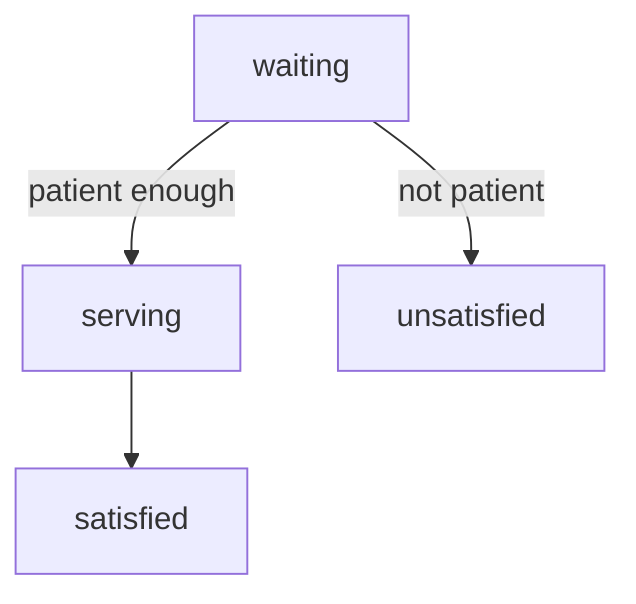

### Example 2 - Queuing up

---

This example explores the situation when customers queuing up at service counter.

The customer could be regarded as a state machine.

```mermaid
graph TD
waiting-->|patient enough|serving
waiting-->|not patient|unsatisfied
serving-->satisfied
```